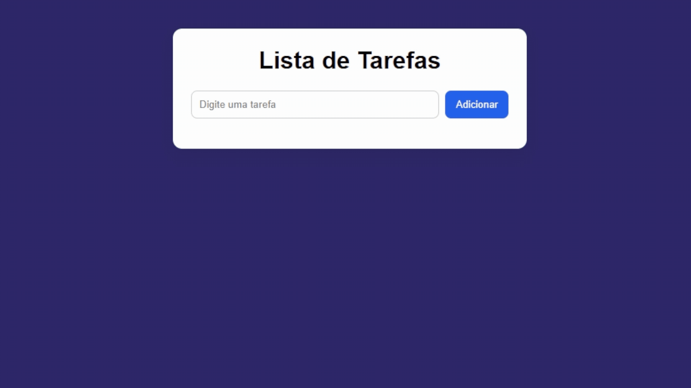

<h1 align="center"> Lista de Tarefas </h1>

    <a href= "#-tecnologias">Tecnologias</a> |
    <a href= "#-projeto">Projeto</a>

 

 

## 🚀 Tecnologias

Esse projeto foi desenvolvido com as seguintes tecnologias:

- HTML e CSS
- JavaScript
- Git e GitHub

## 💻 Projeto

É uma Lista de Tarefas feita em HTML/CSS/JavaScript para estudar mais essas linguagens.